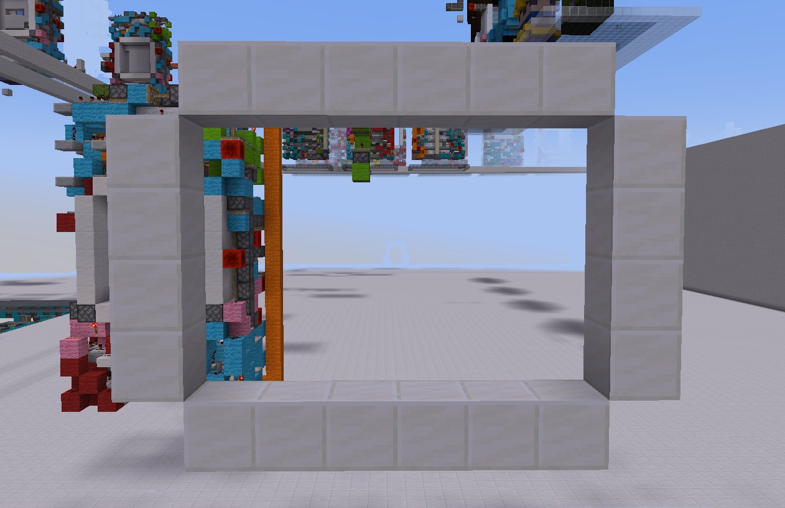

# 服务器活动

风车小镇会举办一些定期活动或不定期活动，用于活跃服务器玩家和增加服务器趣味性，我们欢迎任何有想法的玩家提出活动建议或参与服务器建设。

## 月度挑战

风车小镇会~~定期~~举办趣味性的红石挑战，玩家按照设定目标完成相应红石电路的设计即可完成挑战

### 2024.07.20 - 2024.08.30

本次挑战的内容为**平地隐藏铁轨**, 电路需要在激活时在地面上推出一段铁轨并完成无痕处理, 并在取消激活时将铁轨收至地面以下并完成无痕处理, 如下图所示，其中石英部分为门板，蓝色部分为门框:

本次挑战由bing_ke_le提出，并有参考架构与布线:

**注**: 本次挑战不鼓励使用粘液块或蜜块

**提示**: 可以将铁轨推至**向上的伸出活塞**上并将活塞收回完成铁轨的下拉操作

### 2024.06.20 - 2024.07.31

本次的月度挑战为**限定开门规则的5x5无痕活塞门**，在普通5x5无痕活塞门的基础上，将门板按照从外到内的顺序分为三组，如下图所示，在开门时，活塞门必须按照从内到外，即**绿色**->**黄色**->**红色**的先后顺序，依次收回方块，并且收回时应满足如下规则：
- 在上一组方块被完全收回至门框或门框后时才能开始收回下一组方块。
- 保证开门时，同一组内的所有方块都在同一时间被拉动和收回，即开门的运作过程应该时完全对称的。

**附加挑战**

在完成上述挑战的基础上，您可以选择下面的额外条件完成附加挑战。
* 按照完全**相反的顺序**完成关门，即先推出最中心的红色方块，然后再按顺序推出黄色方块和绿色方块。
* 将相同的规则拓展至**6x6活塞门**。

### 2024.03.01 - 2024.03.31

本次的月度挑战为**2x2无痕活塞门无痕活塞门**，如下图所示，活塞门开启的状态并没有任何特殊之处，但在活塞门关闭后，原先的门板的位置将推出一个**处于开门状态下的2x2无痕活塞门**。

注意事项

* 内部的2x2无痕活塞门无需按照上图的布线制作，活塞门的大小也并不限定为4x6方块，您可以根据架构和布线对内部的2x2无痕活塞门进行**自由调整**。
* 对于有察活塞门，您可以使用**音符盒或其他可移动元件**作为输入源；对于传统活塞门，考虑到输入源的限制，您可以在活塞门关闭后，手动附加一个**拉杆或按钮**作为外置输入源。
* 内部的活塞门和外部的活塞门必须满足**无痕**的条件。

### 2024.02.01 - 2024.02.28

本次的月度挑战为**6x6x6无痕活塞门**，即此次活塞门的门板为三维结构，需要完成一个**致密**的边长为6的正方体的开门和关门，不允许使用粘液块。

## 模组生存

本次模组生存服务器使用的整合包为**冒险与地牢2**(**RAD2**)，版本为1.16.5，您可以通过这个[链接]()(暂时未开放)和QQ群文件下载整合包，该模组生存面向所有玩家开放，预计归档时间在三个月以上，祝您游戏愉快。

您可以通过以下地址加入服务器：

> 主地址： **`modded.windmilltown.net`** 
> 备用地址： **`host.windmilltown.net:26010`** 